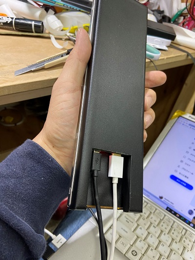

# WideLCD_woodcase

## What is this?
This is an MDF case that attaches to a wide LCD.

## How to make
Cut out the dxf file with a laser cutter and glue it together. After that, shape it with sandpaper.

## Where can i buy it?
it's here.
- [Shigezone.com](https://www.shigezone.com/?product=slimlcd)
